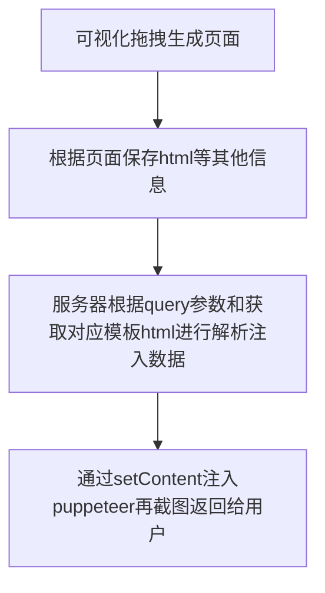

## 背景
在推广业务中，常常会遇到合成带二维码海报分享功能，并且为了推广力度，需要同时在APP、WEB、小程序都有此功能加大曝光，各端都需要单独编写，复用能力差，效率低。本身合成海报业务并无难度，在此背景下为了提高效率开发了lumu-poster海报合成工具(技术栈：nestjs + react + mysql)

## 分析
在现有社区中针对海报生成本身已经有很多成熟方案，如下：
1. html2canvas/canvas插件截图 
2. 服务器(java，node等)绘制 
3. 服务器使用puppeteer无头浏览器生成

### html2canvas/canvas绘制截图
- 优势：在于完全解放服务器，由前端独立生成，定制化样式强。
- 缺点：部分手机兼容性不足，跨端复用能力不足，性能依靠手机自身

### 服务器插件绘制
- 优势：在于不需要前端处理，跨端复用能力强，性能优。
- 缺点：定制化样式能力不足，编码相对复杂

### 服务器使用puppeteer生成
- 优势：个性定制化强，复用能力强。
- 缺点：性能上限不足

因为本身我们海报不仅仅是图片，还会有表格，长图等偏个性化的内容，所以看重个性化扩展和跨端复用能力，对比上述方案最终选择使用puppeteer生成。

## puppeteer痛点
社区本身有很多关于puppeteer生成图片的方案和文章，但其中发现了几个问题
1. 社区中使用puppeteer常用url访问页面然后生成图片，这样会导致每个合成的图片都需要前端去做一个页面并且对接动态数据，相当于把工作量全部放在前端。
2. 现有海报方案里，都是通过page.goto方式进行网络页面加载，需要前端每个海报都创建页面，测试，部署，发布；流程复杂且无法解放前端。响应速度则特别依赖页面资源加载和网络状态。前后端分离情况，页面需要请求后台动态加载内容基本在800ms-1500ms左右，采用服务端渲染页面简单的截图页基本上优化到400-500ms的情况，即便如此加之其他业务处理，接口响应基本在800ms左右。
3. puppeteer在每开一个tab页面及需要大约30M内存，并且同时多开tab执行业务会导致cpu负载，这个则决定了puppeteer的单机上限，代码上优化程度有限。

## 解决方案
针对上述3个痛点，我是如何解决这些问题呢？

### 关于痛点1
主要是需要解放前端双手，本身海报业务并不复杂，一般是图片(背景图，头像，二维码等)，文字，表格等这些简单的元素。这种简单特定业务即可使用可视化方式进行生成，这里我选用了React作为UI框架，通过自定义json scheam作为数据存储格式，动态渲染页面。在设计可视化中内在核心是：组件编排和表单编排。

#### 组件编排
在设计组件编排时考虑到可视化在其他项目都有可用性，这里使用了插件化的方式为组件赋能，及组件本身只有渲染能力，如果需要给组件扩展能力，及使用高阶组件的方式进行注入，这里布局统一使用了绝对布局，使用moveable插件进行二次封装成一个高阶组件来实现拖拽。
<div align="center">

</div>

基础组件的json scheam定义，所有组件需要在此ComponentSchema上进行继承
```ts
// 组件类型
export type ComponentTypes = 'TEXT' | 'PICTURE' | 'CANVAS'; 
// 组件配置
export interface ComponentSchema {
    /** 服务器唯一id */
    id: string;
    /** 节点名称 */
    nodeName: string;
    /** 组件类型 */
    name: ComponentTypes;
    /** 组件外层挂载id */
    domId: string;
    /** 组合id */
    groupId: string;
    /** 父id */
    parentId: string;
    /** 组件样式 */
    styles: React.CSSProperties;
    /** 自定义内容 */
    custom: unknown;
    /** 子组件内容 */
    children?: ComponentSchema[];
}
```
文字组件的示例
```ts
import React from 'react';
import { ComponentSchema } from '../../interface';

export interface TextProps extends ComponentSchema {
    custom: {
        text: string
    }
}

const Text: React.FC<TextProps> = ({ custom, styles, domId, groupId, children }) => {

    return (
        <div
            className={groupId}
            id={domId}
            dangerouslySetInnerHTML={{__html: custom.text}}
            style={styles}>{children}</div>
    )
}

Text.displayName = 'Text';

export default Text;
```
然后通过组件插件系统进行组件注册，在注册的时候进行特定高阶组件注入。流程如下：

页面渲染组件
```ts
import React from 'react';
import { ComponentSchema } from './interface';
import { getViewPlugin } from './view-plugins';

const StaticViewRender: React.FC<{ dataSource: ComponentSchema[], mock: boolean }> = ({ dataSource, mock }) => {
    return (
        <React.Fragment>
            {
                dataSource.map((data) => {
                    const plugin = getViewPlugin(data.name);
                    if (plugin) {
                        const Component = plugin.component;
                        return (
                            <Component key={data.domId} {...data} mock={mock}>
                                { data.children && <StaticViewRender mock={mock} dataSource={data.children} />}
                            </Component>
                        )
                    }
                    return null;
                })
            }
        </React.Fragment>
    )
}
```

#### 表单编排
在可视化系统中，表单主要是通过组件属性生成对应的表单，有些属性我们并不想用户编辑，所以在设计表单时，我们同样使用自定义json schema的方式定义表单并通过插件注册的方式进行注入系统，通过组件名称进行关联组件。因为antd form本身的规范化得以很容易的写出基础的动态渲染表单。因为海报本身会有动态内容，所以这里做了一个简单的字符串解析，通过规则注入动态数据。在创建海报时通过${变量}的方式告诉编辑器这里是动态数据的key,然后在渲染的时候，使用者通过url query的方式调用进行匹配。如海报完成后会生生一个url http://x.x.x.x/tool/screenshot?id=10&clipWidth=694&clipHeight=684&name=&headImg=&code=
这个url就是图片地址，其中name/headImg/code就是在制作海报时的动态数据key

效果图：
<div align="center">

</div>

这样基本解放了前端，一般海报涉及4-5个元素，基本在3分钟内就可以完成海报发布。

### 关于痛点2
上述可视化编辑器已经完成了页面生成，现在通过goto方式直接访问，但是发现本身系统使用react，react包本身不小且如果基础组件越来越多则打包的资源便会增加，而且现代开发方式，需要通过js读取完成后再过去当前模板的json，然后再渲染，这种方式导致渲染时间直接拖长。这里最开始想到使用动态渲染组件来减少组件的资源，但是发现本身海报业务里的组件资源并不多，主要还是react本身资源，这时候想到，本身海报渲染使用react大材小用，不如使用上一代开发方式，页面直接写在html上，完全就避免了js的渲染的性能消耗。但是如果直接写到html上，这个时候一定想到了服务端渲染，但服务端渲染需要搭建一个ssr服务，但也是没有避免加载react依赖，感觉大材小用，毕竟react和reactdom本身包也不小，其实就是渲染html，感觉通过react vue都有点大材小用，这时候发现puppeteer中的setContent这个api可以直接注入html进行页面渲染，这样可以最大程度上规避页面网络因素，本身我们海报也不需要js，css。感觉方案很棒，那如何方便的注入html呢？其实我们在做可视化的时候已经就有html，只是没有动态内容，那在完成时通过规则直接把html存入数据库即可。通过这套规则，合成海报基本能在150ms-400ms完成，最大程度上减少了包体积和网络因素。
```ts
  @Get('/updateScreenshot')
  async updateScreenshot(
    @Res() res: Response,
    @Query() query: {
      id: string,
      clipWidth: string,
      clipHeight: string,
      clipType?: 'png' | 'jpeg',
      clipScale?: string,
      [key: string]: string
    }
  ) {
    const { id, clipWidth, clipHeight, clipScale = 1, clipType = 'png', ...params } = query;
    const pictureInfo = await this.pictureService.findById(+id);
    // 通过解析自定义规则注入真实数据
    const html = renderStr(pictureInfo.html, params);
    const buffer = await pool.use(async (page: puppeteer.Page) => {
      await page.setContent(html);
      const buffer = await page.screenshot({
        type: clipType,
        encoding: 'binary',
        clip: {
          x: 0,
          y: 0,
          width: +clipWidth,
          height: +clipHeight
        }
      }) as Buffer;
      return buffer;
    });

    res.setHeader('Content-Type', 'image/png');
    res.setHeader('Content-Length', buffer.length);
    res.status(200).send(buffer);
  }
```
```ts
const renderStr = (str:string, context: object = {}) => {
  const tokenReg = /\$(\\)?\{([^\{\}\\]+)(\\)?\}/g;
  //@ts-ignore
  return str.replace(tokenReg, (word, slash1, token, slash2) => {
    if (slash1 || slash2) {
      return word.replace('\\', '');
    }

    let variables = token.replace(/\s/g, '').split('.');
    let currentObject: object = context;
    let i, length, variable;
    for (i = 0, length = variables.length, variable = variables[i]; i < length; ++i) {
      //@ts-ignore
      currentObject = currentObject[variable];
      if (currentObject === undefined || currentObject === null) return '';
    }

    return currentObject;
  })
}
```

### 关于痛点3
暂时没有特别好的解决方案，可以使用serverless或者在高并发下我们使用队列的方式来平滑输出。

## 整体流程



## 最后
已经做过2个NoCode编辑器，发现NoCode并不能做到大而全，反之都是针对特定场景或者细分领域的，只有在这些场景下，前端交互相对简单，才能够沉淀出足够多的组件。不管哪种场景底层都需要依靠组件编排和表单编排，针对这2类的开发就变得尤为重要，希望结识更多对NoCode/LowCode/ProCode感兴趣的朋友相互交流。

附：还可以更近一步，通过上传psd文件解析成组件，这样连拖拉拽都可以直接省掉，达到秒级生成海报。